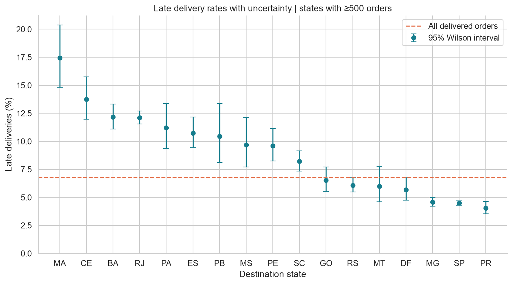

# Commerce Delivery Intelligence

[](https://github.com/Pariamazaheri/commerce-delivery-intelligence/actions/workflows/quality.yml)

**A reproducible study of marketplace delivery reliability, customer experience,
and purchase-time risk.**

Late deliveries create operational friction and unhappy customers. This project
turns six relational ecommerce tables into an audited order-level dataset,
investigates destination service levels, quantifies uncertainty, and evaluates
a delivery-risk benchmark on later purchases. It demonstrates data engineering,
statistical reasoning, feature design and honest model evaluation in one readable
workflow.

## Executive findings

Analysis of the original [Olist Kaggle dataset](https://www.kaggle.com/datasets/olistbr/brazilian-ecommerce)
produced these historical findings:

- **96,470** valid delivered orders; **6.8%** arrived after the promised calendar date.
- Median purchase-to-delivery time was **10.2 days**.
- Poor ratings (1-2 stars) occurred in **62.4%** of reviewed late deliveries,
  compared with **9.3%** of reviewed on-time deliveries. The gap was **53.2 percentage
  points**, with a 95% order-level bootstrap interval of **51.9-54.4 points**.
- The all-feature logistic benchmark achieved later-period **ROC AUC 0.715** and
  **average precision 0.076**, against a prevalence baseline of **0.035**.
- Selecting the top 12 mutual-information inputs reduced average precision to
  **0.057**. High marginal association did not guarantee better temporal performance.

These associations support route audits and controlled intervention pilots.
They do not establish a causal effect or quantify cost savings. The statistical
results describe delivered orders in a historical Brazilian marketplace.



Start with the [executed notebook](notebooks/delivery_intelligence.ipynb) or the
[executive findings](reports/executive_summary.md). The notebook contains embedded
PNG charts for GitHub readers and a Plotly explorer for interactive use.

## Methodology

1. **Acquire and audit:** download the original public Kaggle archive, retain
   SHA-256 fingerprints, inspect missingness and exact duplicates, and validate
   unique entity/item keys.
2. **Construct the analytical grain:** aggregate items and sellers before joining
   customers and reviews. Resolve multiple reviews deterministically. Keep one row
   per order and audit excluded records.
3. **Clean:** parse dates, invalidate implausible amounts/weights, preserve missing
   totals, and select delivered orders with plausible purchase/delivery timelines.
   Large valid amounts remain in the data.
4. **Explore:** use pie, box, line, multi-line, bar, grouped/stacked bar, scatter and
   bubble charts. Compare state rates with Wilson intervals and rating risk
   differences with a seeded bootstrap. Export an offline interactive Plotly chart.
5. **Engineer features:** create shipping/value ratios, fixed monetary bins,
   logarithms, cyclical calendar features, interstate routing share and order-level
   counts. Encode categorical inputs and standardize numeric inputs.
6. **Evaluate:** split purchase dates chronologically near 80/20 and exclude training
   labels that were not yet observable at the cutoff. Fit imputation, encoding, MI
   selection and PCA only on training data. Compare a prevalence baseline and two
   fixed logistic benchmarks with ROC AUC, average precision, Brier score and
   calibration diagnostics.
7. **Interpret:** retain PCA components explaining at least 90% of numeric training
   variance, inspect loadings, and discuss when feature engineering is essential.

The risk benchmark assumes that seller assignment, item attributes and the shipping
quote are known at checkout. IDs, reviews, actual delivery dates and delay duration
are excluded from model inputs. See the [feature dictionary](docs/feature_dictionary.md)
and [analysis coverage](docs/analysis_coverage.md).

## Installation and usage

Use Python **3.11 or newer**. The saved run was validated on macOS with Python 3.14;
`requirements.lock` records that exact environment. The package specification lets
pip resolve compatible dependencies on other supported platforms.

```bash
python -m venv .venv
source .venv/bin/activate  # Windows: .venv\Scripts\activate
python -m pip install '.[dev]'
commerce-insights download
commerce-insights run
```

Run commands from the repository root. Acquisition needs internet access; analysis
is offline once the six required CSVs are in `data/raw/`. If Kaggle's public download
endpoint is unavailable, download the archive from its data card and extract those
CSVs manually. Raw data is deliberately excluded from Git.

Open `notebooks/delivery_intelligence.ipynb` in VS Code or Jupyter with the installed
environment. To execute and save all outputs programmatically:

```bash
python -m ipykernel install --prefix .venv --name python3
JUPYTER_PATH=.venv/share/jupyter python scripts/execute_notebook.py
```

The pipeline regenerates data-quality diagnostics, numerical encodings, state and
review tables, MI rankings, PCA loadings, metrics, **14 static figures** and the
self-contained `reports/interactive/route_explorer.html`. Random procedures use
seed 42. The HTML is generated locally and ignored by Git to keep the repository
compact.

## Repository layout

```text
commerce-delivery-intelligence/
├── data/                       # Acquisition notes; ignored raw/processed tables
├── notebooks/                  # Executed end-to-end narrative
├── src/commerce_intelligence/   # Data, statistics, modeling, visualization, CLI
├── reports/                    # Measured insights, metrics, figures, tables
│   └── market_snapshot/         # Independent 50-car Samand snapshot and Excel
├── docs/                       # Feature definitions, scope, publishing guide
├── scripts/                    # Notebook construction and execution
├── tests/                      # Adversarial grain, date and leakage checks
└── .github/workflows/           # Automated lint, tests and notebook validation
```

## Optional Iranian market acquisition

A separate bounded scraper collects 50 public **Samand** cars manufactured
strictly after Solar Hijri 1385 from Bama. The included snapshot contains price,
mileage, color, year, transmission and description, plus source URLs and collection
timestamps. Five prices are unavailable; they stay blank rather than becoming zero.

```bash
python -m commerce_intelligence.scraping --target 50 --xlsx
```

See [market snapshot notes](docs/market_snapshot.md). This extension checks robots
rules, requests pages sequentially, validates fields and reports incomplete
collection instead of inventing records. Model-filter sampling is not representative
of the entire Iranian used-car market.

## Quality and reproducibility

```bash
ruff check src tests scripts
ruff format --check src tests scripts
pytest -q
python scripts/validate_results.py
```

Tests cover duplicate keys, item aggregation, same-day delivery, invalid amounts,
mixed date formats, future-label exclusion, feature leakage, archive safety and
scraper schema failure. CI runs offline checks on Python 3.11 and 3.14 and verifies
that committed notebook outputs, report totals and Excel records are consistent. Full notebook
execution is an explicit integration check because raw data is not stored in Git.
See [validation evidence](reports/validation.md).

## Limitations and licensing

Review response, delivery completion, time drift and repeated customer/carrier
effects limit interpretation. State is a routing proxy. No carrier identifiers,
intervention outcomes or operational cost model are available. This is a tested
analytical project; a production risk service would additionally need monitoring,
rolling validation, calibrated thresholds and verified feature availability.

Original Python code is MIT licensed. Olist's dataset is **CC BY-NC-SA 4.0**, as
listed in Kaggle's public metadata; data-derived reports and visualizations are
provided under that license. The MIT license does not grant commercial rights to
Olist data or its derivatives. Bama listing content remains third-party content.
See [NOTICE](NOTICE.md) for attribution and scope.

For GitHub publishing and Colab setup, follow the [publishing guide](docs/publishing.md).
Suggested repository name: **`commerce-delivery-intelligence`**.
